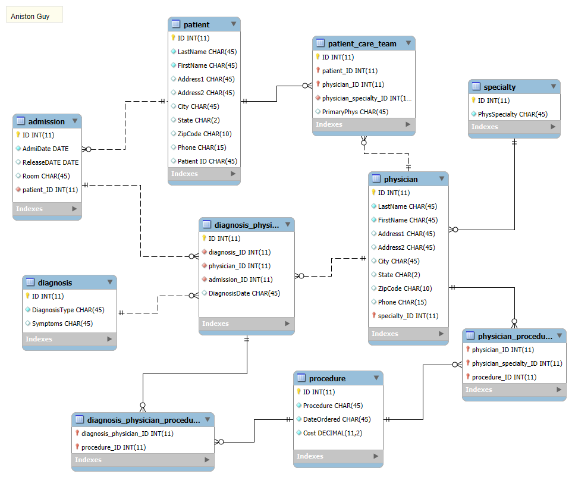

# sql-hospital-database-TTUAG
A relational database schema modeling patients, doctors, and medical procedures, including a full EER diagram and demonstration SQL queries. Final project for ISQS 3348 

## Entity Relationship Diagram

*Full MySQL Workbench file available in [`hospital.mwb`](./hospital.mwb)*

## Schema Overview
 
The database consists of 10 tables modeling the following core entities and relationships:
 
- **patient** — patient demographic and contact information
- **admission** — tracks patient hospital stays (admit date, release date, room)
- **physician** — physician demographic info, linked to a specialty
- **specialty** — physician specialties (e.g. Cardiology, Pediatrics)
- **diagnosis** — diagnosis types and symptoms
- **procedure** — medical procedures, including cost and order date
- **patient_care_team** — links patients to their assigned physician(s)
- **diagnosis_physician_admission** — junction table connecting a diagnosis, the
  treating physician, and the related admission (many-to-many)
- **physician_procedure** — junction table linking physicians to the procedures they perform
- **diagnosis_physician_procedure** — junction table linking a diagnosis/physician/admission
  case to the procedures used to treat it
## Key Design Features
 
- Many-to-many relationships modeled through dedicated junction tables (a physician can
  treat multiple diagnoses; a diagnosis case can involve multiple procedures)
- Foreign key constraints enforce referential integrity between patients, admissions,
  physicians, and procedures
- Normalized structure separates demographic data (patient, physician) from transactional
  data (admission, diagnosis, procedure)
## Sample Queries
 
See [`queries.sql`](./queries.sql) for full query code. Included examples:
 
1. All procedures performed for a given patient, with ordering physician and cost
2. Physicians grouped by specialty
3. A patient's full care team, including primary physician
4. Total procedure cost billed per admission
*Note: these are demonstration queries written against the schema below to illustrate
how the database can be used. Original coursework queries were completed by hand on a
written final exam.*
 
## Tools Used
MySQL Workbench — schema design, EER diagramming, and query development
 
